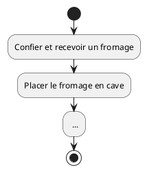
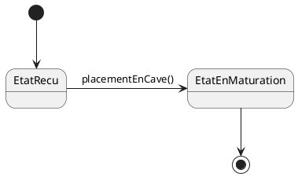
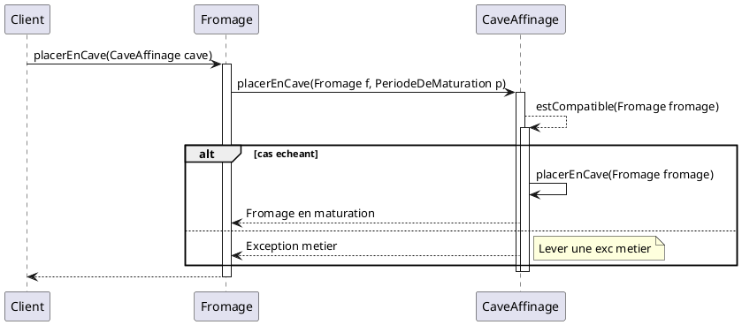

# Placement en cave

## Cas d'utilisation

Acteur : Maison d'affinement

Objectif : Pouvoir placer un fromage en cave.

Succès : Le fromage est placé dans la cave.

Échec :
- Une cave ne peut pas dépasser sa capacité maximale.
- Un fromage ne peut être place dans une cave incompatible.
  La température cible et l’humidité cible de la cave doivent entrer dans la plage acceptable de la famille du fromage.
- Un fromage ne peut être place que dans une seule cave sur une meme période.

## Activité



## Etat transition



## Sequence




## Le modèle

```plantuml
class CaveAffinageId <<ValueObject>> {
    -id: UUID
}

class FromageId <<ValueObject>> {
    -id: UUID
}

class Fromage <<RootAggregate>> {
    -caveAffinageId: CaveAffinageId
    -void verifierEtat()
    +void placerEnCave(uneCommande: PlacerEnCaveCommande)
}

class CaveAffinage <<Entity>> {
    -fromageId: Set<FromageId>
    -void peutAccueillir(unFromage: Fromage)
    +void accueillir((unFromage: Fromage)
}

Fromage --> FromageId
CaveAffinage --> CaveAffinageId
Fromage --> CaveAffinage
```